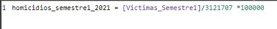
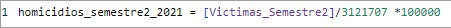
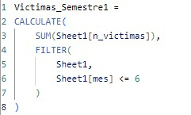
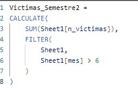
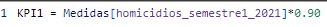
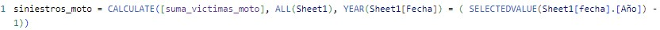
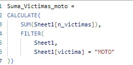
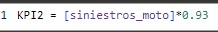

# Objetivo

El objetivo principal de este proyecto es hacer un análisis de datos con el dataset que nos proporcionó Soy Henry para este desafío. La idea es realizar un EDA y realizar un dashboard implementando KPI para poder realizar un trabajo predictivo de alto nivel.

Los datos con lo que voy a trabajar se encuentran en este enlace de Github (SoyHenry)[https://github.com/soyHenry/PI_DA/tree/Full_Time]

# ETL

El trabajo de ETL se puede encontrar en la carpeta de ETL_exportación con una mejor explicación ya que voy detallando paso a paso como limpio y exporto la base de datos que me fue dado para realizar este trabajo.

# EDA 

Al igual que en el apartado anterior, se puede ver de mejor manera en la carpeta de EDA. En este proceso realizo un EDA mostrando las estadísticas de nuestro trabajo, graficación de distintas columnas que realmente me parecieron interesante para trabajar y por último una pequeña correción a la hora de exportar mi data para poder trabajar mejor en mi dashboard.

# Dashboard

En el dashboard que proporciono en la carpeta de Power BI se puede encontrar la data limpia que mencioné anteriormente y también se puede ver un EDA pero de manera más ordenada ya que al estar en un Dashboard da lugar a una mejor lectura. También se puede ver las KPI's que me proporcionaron para que yo pueda trabajar y les puedo mostrar los ejemplos de estás KPI's.

- KPI 1

  Reducir en un 10% la tasa de homicidios en siniestros viales de los últimos seis meses, en CABA, en comparación con la tasa de homicidios en siniestros viales del semestre anterior.

  A este KPI se llega de esta manera:

  

  

  

  

  

  - KPI 2

    Reducir en un 7% la cantidad de accidentes mortales de motociclistas en el último año, en CABA, respecto al año anterior.

    A este KPI se llega de esta manera:

    

    

    
  
  # Conclusión

  Para evitar futuros problemas de tránsito lo que se tiene que promover mucho más la educación vial (sea mediante talleres o redes sociales), mejorar los controles viales (sea control de alcoholemia o control rutinario), mejorar la estrategia para evitar congestionamiento de tráfico, mejorar las calles y avenidas (sea cambiar el asfalto como pintura de esta misma) y mejorara todo lo que es referido a señales viales tantos las comunes como los carteles de propaganda para seguir educando y mejorando la vialidad.
